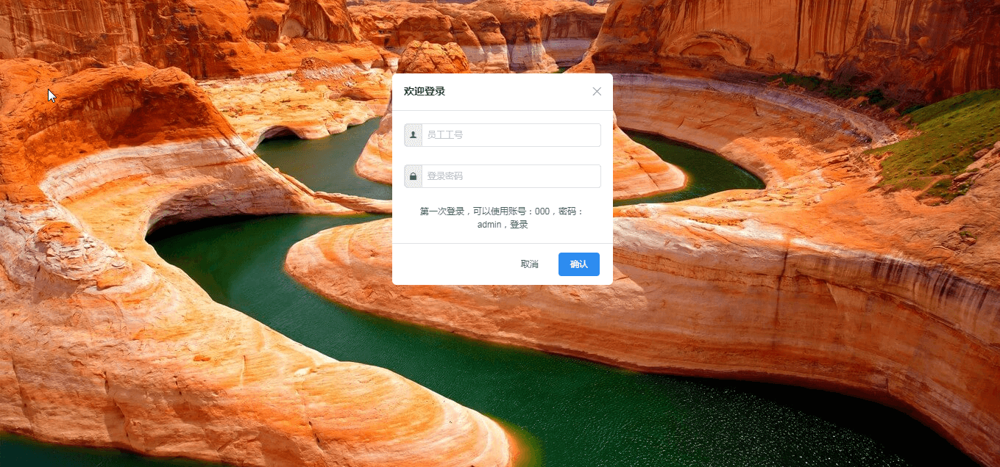
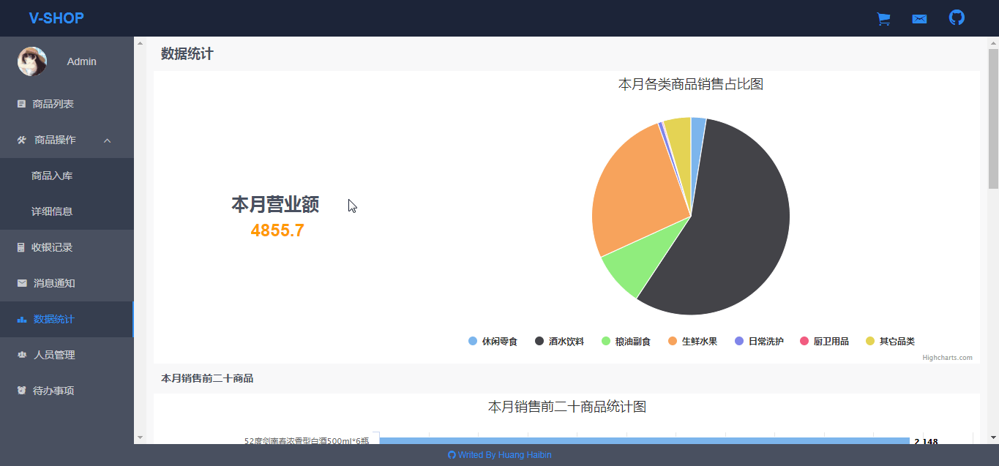
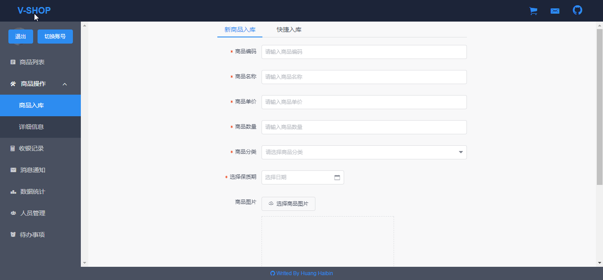
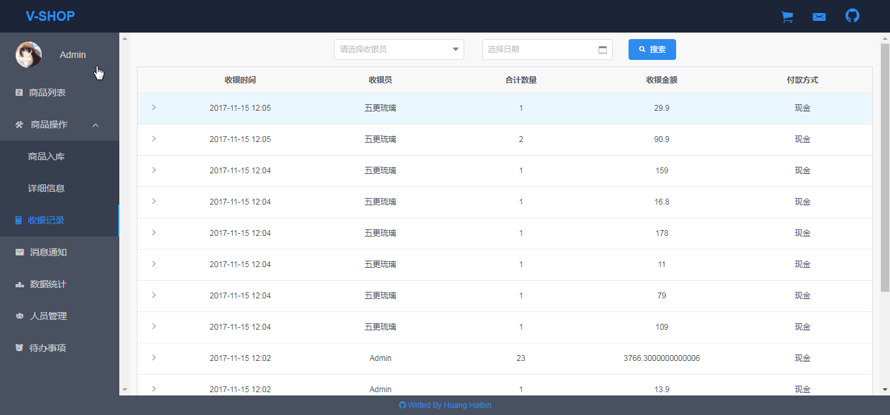

# V-Shop  #
Vue构建的小商店管理系统Web APP

### [项目线上预览地址](https://huanghaibin91.github.io/V-Shop-Preview/#/) ###

在项目中主要使用：

- vue-cli 构建项目
- iview 实现UI组件样式
- IndexedDB 实现数据存储

其实早前我写过一个同样功能的[https://github.com/huanghaibin91/Checkout-counter](https://github.com/huanghaibin91/Checkout-counter "这是链接")，样式啥的都是自己写的，不怎么好看，有的功能也没有完成。最开始想修修补补，后来看算了，就重新写了一个，为了统一样式和学点新东西，就使用了iview库统一UI，使用IndexedDB实现数据的存储读取，不过IndexedDB这种浏览器端的数据库有个最大的问题就是不安全，一打开控制台就什么都暴露了，所以不要在IndexedDB中存储私密信息。使用highChart完成简单的图表绘制。

# 项目构成 #

- 登录界面
- 商品列表
- 商品操作
- 收银记录
- 消息通知
- 数据统计
- 人员管理
- 待办事项

# 项目部分截图 #

